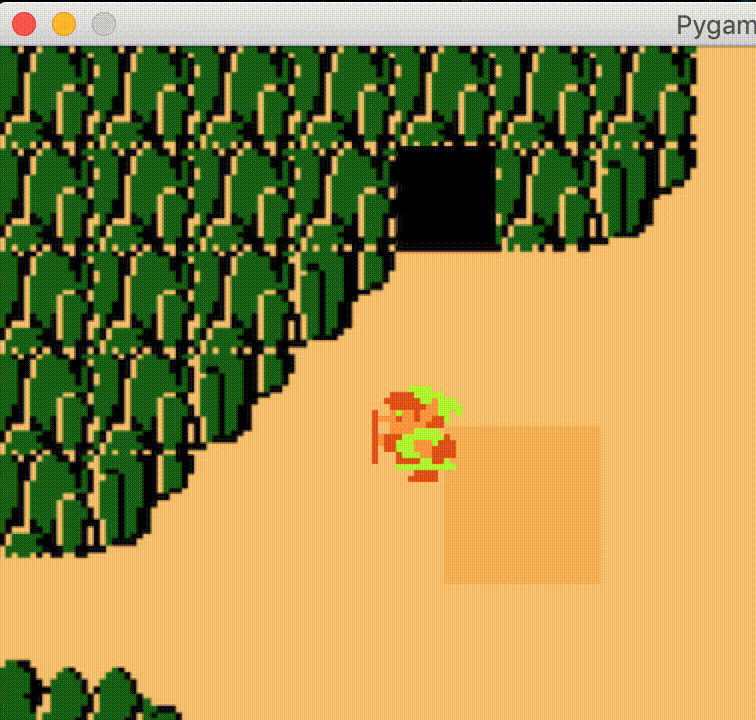

# pygamezero-zeldaclassic

A barebones and proudly janky clone of NES Zelda (1986) for teaching kids to program in Python using [@lordmauve's](https://github.com/lordmauve) [Pygame Zero](https://github.com/lordmauve/pgzero). 



Requires Pygame Zero
```
pip install pgzero
```

Run using the Pygame Zero CLI:
```
pgzrun zelda-classic.py
```


